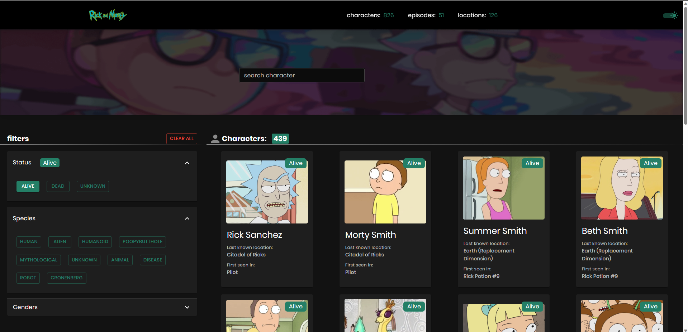

# Rick and Morty Character Search App



## فهرست مطالب 

- [Description](#description)
- [Demo](#demo)
- [Installation](#installation)
- [usage](#usage)
- [technologies-used](#technologies-used)
- [features](#features)


## Description

برنامه جستجوی شخصیت ریک و مورتی یک برنامه وب مبتنی بر ری‌اکت است که به کاربران اجازه می‌دهد شخصیت‌های برنامه تلویزیونی انیمیشن محبوب «ریک و مورتی» را جستجو و فیلتر کنند. کاربران می توانند با جستجو کردن در کادر جستجو یک لیست صفحه بندی شده از شخصیت‌های منطبق را مشاهده کنند.

----
## Demo

نسخه پابلیش شده روی سرور 
 [لینک](https://rick-and-morty-git-master-m-ghalevand.vercel.app/)

---
## Installation

برای اجرای پروژه به صورت محلی، مراحل زیر را انجام دهید:
==
1. کلون کردن ریپازیتوری:

```shell
git clone https://github.com/M-ghalevand/rick-and-morty.git
```

2. به دایرکتوری پروژه بروید:

```shell
cd rick-and-morty
```

3. وابستگی ها را نصب کنید:

```shell
yarn
```

4.  راه‌ اندازی سرور:

```shell
yarn start
```

اکنون برنامه در این آدرس در حال اجرا می‌باشد. 
[`http://localhost:3000`](http://localhost:3000)
---
## Usage

- نام شخصیت ریک و مورتی را که می خواهید جستجو کنید را در کادر جستجو وارد کنید.
- برنامه یک لیست صفحه بندی شده از شخصیت‌ها را نمایش می دهد که با عبارت جستجو مطابقت دارند.
- بر روی شماره صفحه کلیک کنید یا از دکمه های "بعدی" و "قبلی" برای پیمایش در لیست صفحه بندی شده استفاده کنید
- شما می‌توانید با استفاده از فیلترهای مختلف، لیست شخصیت‌ها را بر اساس وضعیت، جنسیت و گونه‌ها فیلتر کنید.

## Technologies Used

- React 
- typescript
- Redux Toolkit
- Apollo Client  requests
- Material-UI for UI components
- SASS for CSS styling

## Features

- جستجو و فیلتر شخصیت های ریک و مورتی
- نمایش صفحه بندی شده نتایج برای تجربه کاربری بهتر.
- نمایش فیلترها
- طراحی ریسپانسیو جهت نمایش در دستگاه های مختلف.